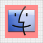
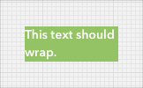
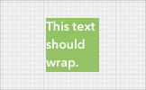
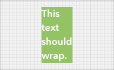
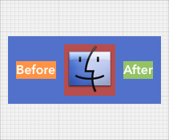
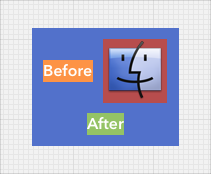
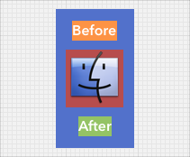

Tutorial 7: Desired Size
==

<!-- TEMPLATE START -->

### Introduction

What size will a subview be in WeView layout?

The _\[UIView sizeThatFits:(CGSize)size\]_ method returns the _desired size_ for any given view.  A view's _desired size_ reflects the "natural" size for its content.

The _desired size_ of a non-wrapping _UILabel_ is determined by its text, font, etc.

The _desired size_ of a UIImageView is the size of its image.

The _desired size_ of a WeView is the minimum size in which its subviews can be layed out properly, honoring its margins, spacing, etc.  

If a WeView has _multiple layouts_, its minimum size is the max width or height needed by any of its layouts.

### Text Wrap, Flow Layouts, etc.

For some UIViews, their _desired size_ is context-dependent.  

A UILabel can _wrap_ its text (for example, if numberOfLines = 0 and lineBreakMode is NSLineBreakByWordWrapping).  For a wrapping UILabel, it's _desired size_ depends on the available space.  

The less horizontal space is available, the greater will be the UILabel's desired height.

Similary, WeViews that use a _Flow Layout_ wrap their contents like text.

For this reason, the _\[UIView sizeThatFits:(CGSize)size\]_ method has a _size_ parameter that reflects the available space. The width and height of the _size_ parameter should be >= 0.

If _\[UIView sizeThatFits:(CGSize)size\]_ is called with a size of _CGSizeZero_ (ie. width = 0 and height = 0), a UIView should return its _ideal desired size_.  For a UILabel, this would be the _desired size_ without any text wrap.

However, if _\[UIView sizeThatFits:(CGSize)size\]_ is called with a non-zero size, the UIView should return its _desired size_ in the context of the available space.

### Manipulating Desired Sizes

WeViews offer a variety of ways to manipulate the _desired size_ of a subview.

	- (UIView *)setMinWidth:(CGFloat)value;
	- (UIView *)setMaxWidth:(CGFloat)value;
	- (UIView *)setMinHeight:(CGFloat)value;
	- (UIView *)setMaxHeight:(CGFloat)value;

These methods let you set a maximum or minimum desired width or height.

	// Sets both the minWidth and maxWidth properties.
	- (UIView *)setFixedWidth:(CGFloat)value;
	
	// Sets both the minHeight and maxHeight properties.
	- (UIView *)setFixedHeight:(CGFloat)value;
	
	// Sets all of the minWidth, minHeight, maxWidth and maxHeight properties.
	- (UIView *)setFixedSize:(CGSize)value;

These methods let you set more than one property at a time.  

You can assign a UIView a _fixed_ desired width by setting its minWidth and maxWidth properties to the same value.

### Ignoring Desired Sizes

	- (UIView *)setIgnoreDesiredSize:(BOOL)value;
	
	// Equivalent to [UIVIew setIgnoreDesiredSize:YES].
	- (UIView *)setIgnoreDesiredSize;

If this property is set, the WeView layouts will treat the _desired size_ of this subview as _CGSizeZero_, ie. width = 0, height = 0.  We usually want to ignore the _desired size_ of a subview when the subview is set to _stretch_ horizontally and vertically.

<!-- TEMPLATE END -->

Next\: [Tutorial 8: Stretch](TutorialStretch.html)