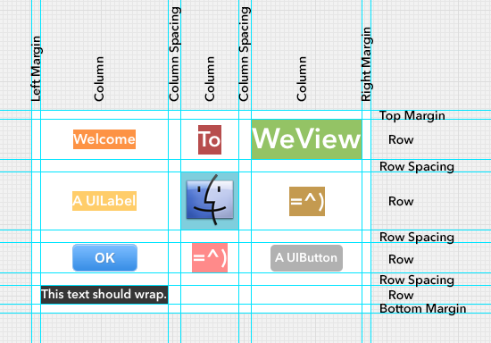
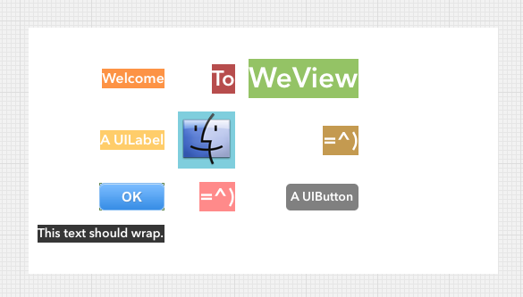
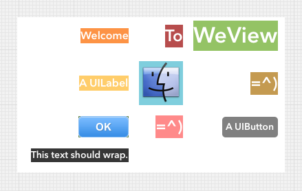
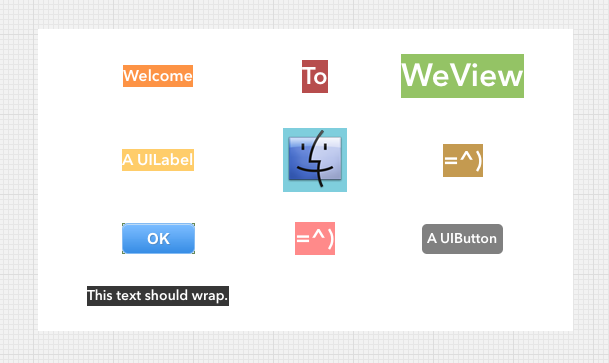
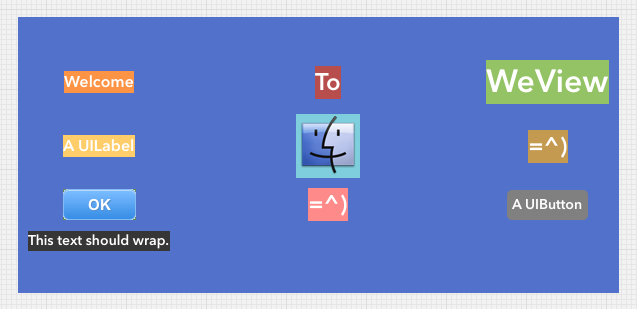

# Tutorial 8: Grid Layout

<!-- TEMPLATE START -->

**WeView 2** provides a variety of layouts (ie. Horizontal, Vertical and Stack) which are simplified forms of the grid layout - they're easier to use and understand.  The grid layout, however, is more powerful.

Like the other layouts, the grid layout uses a [cell model](TutorialLayoutModel.html).  The cells are arranged in **rows** and **columns**.  Between the rows and columns are **row spacing** and **column spacing**.  Outside the cells lies the top, bottom, left and right **margins**.

All cells of a given grid row have the same height; all cells in a column have the same width.  Subviews are arranged within their cells according to their stretch and cellAlignment properties.  

## Subview Ordering

Subviews are arranged in **"flow order"**, ie. the subviews are arranged left-to-right, top-to-bottom, wrapping like text.  ie. A grid with subviews ABCDEFG and 3 columns will be arranged like so:

    A B C
    D E F
    G

## Column and Row Count

There are two factory methods:

    + (WeViewGridLayout *)gridLayoutWithMaxColumnCount:(int)maxColumnCount;

    + (WeViewGridLayout *)gridLayoutWithMaxRowCount:(int)maxRowCount;

These correspond to the following two methods of **WeView**:

    - (WeViewGridLayout *)addSubviewsWithGridLayout:(NSArray *)subviews
                                        columnCount:(int)columnCount;

    - (WeViewGridLayout *)addSubviewsWithGridLayout:(NSArray *)subviews
                                           rowCount:(int)rowCount;

Basically, you set either a max column count or max row count, but not both.  The actual row and column count is computed accordingly.

## Layout vs. Cell Alignment

*Illustration: the grid's layout has left alignment, but all cells have right cell-alignment.*

We refer to the cells (ie. all rows and columns) and the spacing (but _not_ the margins) between them collectively as the layout's **contents**.  Subviews are aligned within their cells according to the per-subview cellAlignment properties but the **contents** of the layout are aligned within the WeView's bounds according to the per-layout alignment properties.

Layout alignment doesn't matter if the contents of the layout **stretch** (in one or both axes) to fill the bounds of the **WeView**.

## Spacing and Margins

Unlike the other (simpler) layout, the grid layout supports spacing and margins with fixed size and/or stretch.  Spacing and margins values are represented by **WeViewSpacing** which has **size** and **stretchWeight** properties.

## Margin Sizes

*Illustration: topMargin=5, rightMargin=10, bottomMargin=15, leftMargin=20.*

You can use the normal margin properties (ie. **topMargin**, **bottomMargin**, **leftMargin**, and **rightMargin**) as usual.  These reflect the **size** of the margins.

    WeView *gridPanel = [[WeView alloc] init];
    [[gridPanel addSubviewsWithGridLayout:@[view1, view 2, ...] columnCount:3]
     setTopMargin:10.f]];

As usual, there are convenience accessors for setting more than one margin at once: *\[setHMargin:\]*, *\[setVMargin:\]*, *\[setMargin:\]*.

## Margin Stretch

*Illustration: margin stretch weight is 1.f, so is row and column spacing stretch weight, so the margins and spacing stretch equally.*

You can set margin stretch: (ie. **topMarginStretchWeight**, **bottomMarginStretchWeight**, **leftMarginStretchWeight**, and **rightMarginStretchWeight**) as usual.

There are convenience accessors for setting more than one margin stretch weight at once: *\[setHMarginStretchWeight:\]*, *\[setVMarginStretchWeight:\]*, *\[setMarginStretchWeight:\]*.

*Reminder*: As usual, margin stretch does *not* trump margin size; final margin size is their size *plus* any stretch.  Two margins with equal stretch weights but different sizes will not be equal in final size.

## Row and Column Spacing

*Illustration: Default column spacing stretch weight is 1.f, so columns slide out to occupy the WeView's bounds, but default row spacing is fixed (10pt), so they cluster together.*

Like margins, row and column spacing are controlled with size and stretch.

You can control the default spacing between rows and columns using the **defaultRowSpacing** and **defaultColumnSpacing** properties, respectively.

    WeView *gridPanel = [[WeView alloc] init];
    [[[gridPanel addSubviewsWithGridLayout:@[view1, view 2, ...] columnCount:3]
     setDefaultRowSpacing:[WeViewSpacing spacingWithSize:10 stretchWeight:1.f]]
      setDefaultColumnSpacing:[WeViewSpacing spacingWithSize:10]];

The properties use the WeViewSpacing class, which has the following factory methods:

    + (WeViewSpacing *)spacingWithSize:(int)size;
    + (WeViewSpacing *)spacingWithStretchWeight:(CGFloat)stretchWeight;
    + (WeViewSpacing *)spacingWithSize:(int)size
                         stretchWeight:(CGFloat)stretchWeight;

Additionally, each row or column spacing can be individually specified using *\[setRowSpacings:\]* and *\[setColumnSpacings:\]*.

    WeView *gridPanel = [[WeView alloc] init];
    [[[gridPanel addSubviewsWithGridLayout:@[view1, view 2, ...] columnCount:3]
     setColumnSpacings:@[
     // The first element corresponds to the spacing between the first and second column.
     [WeViewSpacing spacingWithSize:10 stretchWeight:1.f],
     // Corresponds to the spacing between the second and third column.
     [WeViewSpacing spacingWithSize:10]]];

You can specify as many WeViewSpacings as you like.  For a given row or column spacing, the corresponding value specified will be used, if present.  Otherwise default row or column spacing will apply.

## Row and Column Sizing

*Illustration: Default column spacing stretch weight is 1.f, so columns slide out to occupy the WeView's bounds, but default row spacing is fixed (10pt), so they cluster together.*

Row and column sizing has some similarities with row and column spacing, but there are **important differences**.  The key difference is that the default behavior is for rows and columns to be sized according to their contents.  Row and Column sizing information is represented by the **WeViewGridSizing** class.  It's a bit like the **WeViewSpacing** class, but it has a **fixedSize** property instead of **size**.  **fixedSize** should only be set if the corresponding rows and/or columns should have a fixed size and not reflect the size of their contents.

    - (WeViewGridLayout *)setDefaultRowSizing:(WeViewGridSizing *)value;
    - (WeViewGridLayout *)setDefaultColumnSizing:(WeViewGridSizing *)value;

Like row and column spacing, you can set default row and column sizing values.

    - (WeViewGridLayout *)setRowSizings:(NSArray *)value;
    - (WeViewGridLayout *)setColumnSizings:(NSArray *)value;

Like row and column spacing, you can also set per-column or per-row sizing values.

The default values apply if no WeViewGridSizing is set using those methods for a given row or column.

## Uniform Sizing

    - (WeViewGridLayout *)setIsRowHeightUniform:(BOOL)value;
    - (WeViewGridLayout *)setIsColumnWidthUniform:(BOOL)value;

You can use these properties to "lock" row height or column width to be uniform.  That is, if isRowHeightUniform is set to YES, all rows will have the same height: the height of the tallest row.  
<!-- TEMPLATE END -->

Next:  <a href="TutorialDesiredSize.html">Tutorial 9: Sizing</a>
