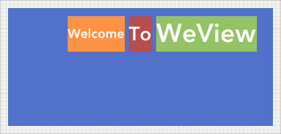

Next\: [Tutorial 6: Stretch](TutorialStretch.html)

Tutorial 5: Layout Model
==

<!-- TEMPLATE START -->

WeView uses a _cell-based_ layout model.  Layouts arrange their subviews by dividing the superview's bounds into _cells_.  Subviews are then positioned within their cell.

Here is a horizontal layout with three UILabels.



If we assign a background color to each UILabel, it's frame (ie. size and position) becomes clear.

And here we see the layout's cells.  

* Each of the three UILabel's layout cells have the same height.  
* The spaces between and around the cells reflect the layout's _spacing_ and _margin_ properties.
* The WeView is shown at it's _desired size_, ie. just large enough to exactly fit its subviews. 
* The layout's _hAlign_ and _vAlign_ properties default to _center alignment_, so the subviews are centered within their cells.

We reveal the subview's layout cells by setting the layout's _cellPositioning_ property to _CELL\_POSITION\_FILL_, which indicates that subviews should always fill the entirety of their layout cell's bounds, regardless of their desired size.



Here we see what happens if that WeView is larger than its _desired size_.

Again, the subview's frames...

...and the subviews' layout cells.

* The layout's hAlign and vAlign properties default to _center alignment_, so the layout cells are centered within the superview's bounds _and_ the subviews are centered within their cells.

Here's the same WeView if we use _top_ and _right alignment_.



The subview frames...

...and the subviews' layout cells.

Note that the layout cells are top- and right-aligned within the superview's bounds _and_ the subviews are top- and right-aligned within their layout cells.  The alignment of the subviews within their cells (or _cell alignment_) defaults to the _layout's alignment_ unless we set an explicit _cell alignment_ for a given subview.

Here we use _center vertical cell alignment_.  We see the subviews...

...and the subviews' frames.



<!-- TEMPLATE END -->

Next\: [Tutorial 6: Stretch](TutorialStretch.html)