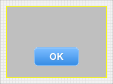

Why use WeView v2?
==

<!-- TEMPLATE START -->

* When using iOS Auto Layout you need to manage considerations such as _constraint priority, constraint sufficiency, constraint conflicts (ie. over-constrained layouts), ambiguous layout, nearest common ancestors_, etc.  It is easy to run afoul of these issues and they greatly complicate refactoring and redesign.  None of those problems apply to WeView v2.
* _Here's a simple code comparison_, based on Apple's sample code that centers a button at the bottom of it's superview bounds with 20pt spacing.

Here's the layout using _iOS Auto Layout_:



iOS Auto Layout also supports a _Visual Format Language_.  Here's the same layout using _VFL_:



Here's the equivalent logic using a _WeView_:



iOS Auto Layout has the advantage of being integrated into Interface Builder, and the Inteface Builder support for iOS Auto Layout has dramatically improved in Xcode 5.  However, as soon as you outgrow what can done in Interface Builder, you must work programmatically and iOS Auto Layout requires verbose, brittle code. 

_WeView v2 can only be used programmatically, and is designed to yield concise, expressive and maintainable code_.  The benefits of the syntax only become more clear as layouts become more complex.

### Other Alternatives:

* [ReactiveCocoaLayout](https://github.com/ReactiveCocoa/ReactiveCocoaLayout) is another alternative to iOS Auto Layout built on [ReactiveCocoa](https://github.com/ReactiveCocoa/ReactiveCocoa).  

<!-- TEMPLATE END -->

Next:  <a href="Tutorial1.html">Tutorial 1: Overview</a>
